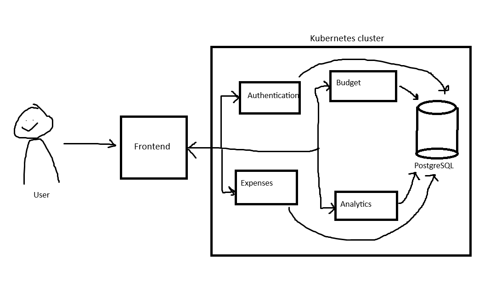

# Finance Management System
Heres the next idea: A finance management system with four differnt serivces + a frontend. Made with Java Spring Boot + React. >:]

Initial ideas for the services:
## Expense Service
* Handle adding, modification and deletion of expences.
* Endpoints:
	* POST /expenses: Add a new expense.
	* GET /expenses: Get all expenses for the authenticated user.
	* GET /expenses/{id}: Get details for a specific expense.
	* PUT /expenses/{id}: Update an expense.
	* DELETE /expenses/{id}: Delete an expense
* Database stores expense dat ( userId, category, amount, timestamp)

## Budget Service
* Manages user-defined monthly budgets and compares with expenses, creates alerts if spending exceeds the budget.
* Endpoints:
	* POST /budgets: Set a new monthly budget.
	* GET /budgets: View the current month’s budget.
	* PUT /budgets/{id}: Update the monthly budget.
	* GET /alerts: Check if spending has exceeded the budget for the current month
* Database stores budget information (userId, month, amount).

## User Authentication Service
* Manages user registration, login, and session management with JWT.
* Endpoints:
	* POST /auth/register: Register a new user.
	* POST /auth/login: Log in the user and generate a JWT token.
	* GET /auth/me: Get the current user information.
* Database stores user info (userId, username, password (hash?)).

## Analytics Service
* Provides data aggregation for reports, such as monthly spending or category-wise breakdowns.
* Endpoints:
	* GET /analytics/summary: Generate a summary of spending for the current month (category breakdown, total spending).
	* GET /analytics/category/{category}: Get detailed spending per category.

## Frontend
Single-page app with React, data visualization with d3.js.

## Architecture

Now I just need to make it...