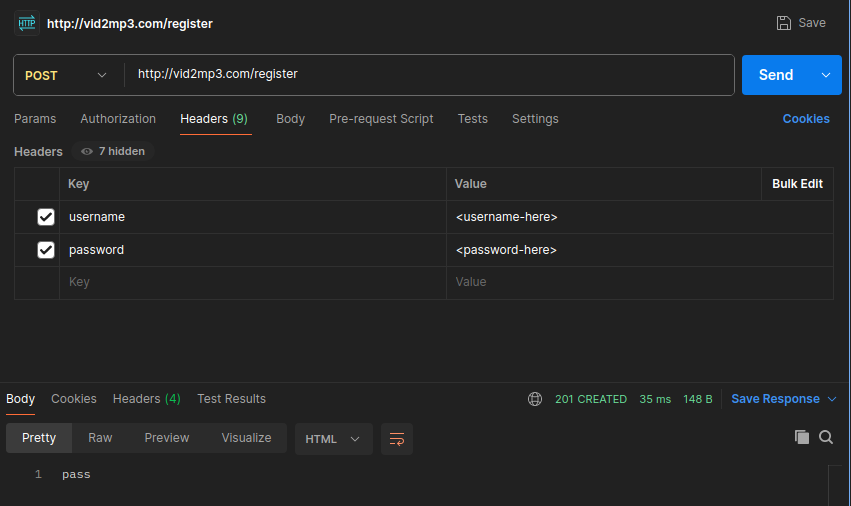
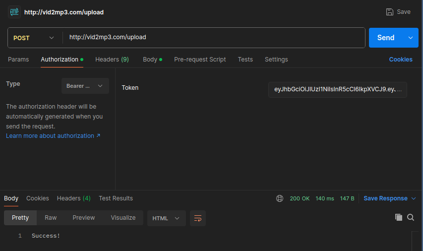
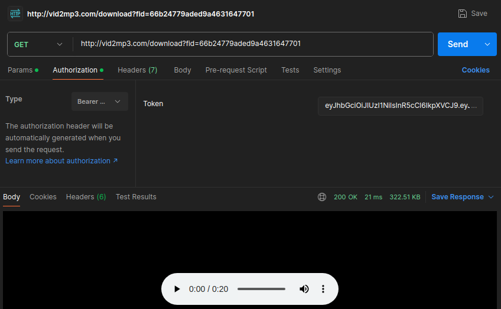

# Vid2Mp3Py

This project is a video file to mp3 (audio) converter, created with a microservice architecture.
It contains four different services, these being the Gateway, Authorization, Converter and Notification services.

The project was made based on the [this video](https://www.youtube.com/watch?v=hmkF77F9TLw) from freeCodeCamp. However, compared to the video, I have made various additions and modifications to the code and deployment of the services.
Some examples of this are:
* The databases are deployed deployed inside the Kubernetes cluster instead of being installed to the local machine.
* New user registration
* Additional error handling
* Etc.

## Tools used in this project

I used the following tools when creating and testing this project:
* [Docker](https://www.docker.com/)
* Local [Kubernetes](https://kubernetes.io/) cluster with [minikube](https://minikube.sigs.k8s.io/docs/)
* [k9s](https://k9scli.io/)
* [MySQL](https://www.mysql.com/)
* [MongoDB](https://www.mongodb.com/)
* [RabbitMQ](https://www.rabbitmq.com/)
* Python3 with [Flask](https://flask.palletsprojects.com/en/3.0.x/), etc.
* [Postman](https://www.postman.com/)

## Architecture

## Testing with Postman
I tested the project's functionalities by sending HTTP requests with Postman. Here's some images of the setup:

Registering a new user:

Performing login:

Uploading a video file:

Downloading the audio:

